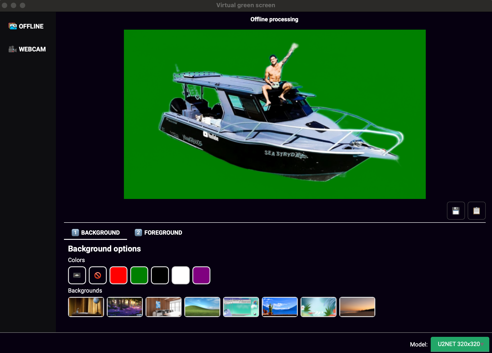
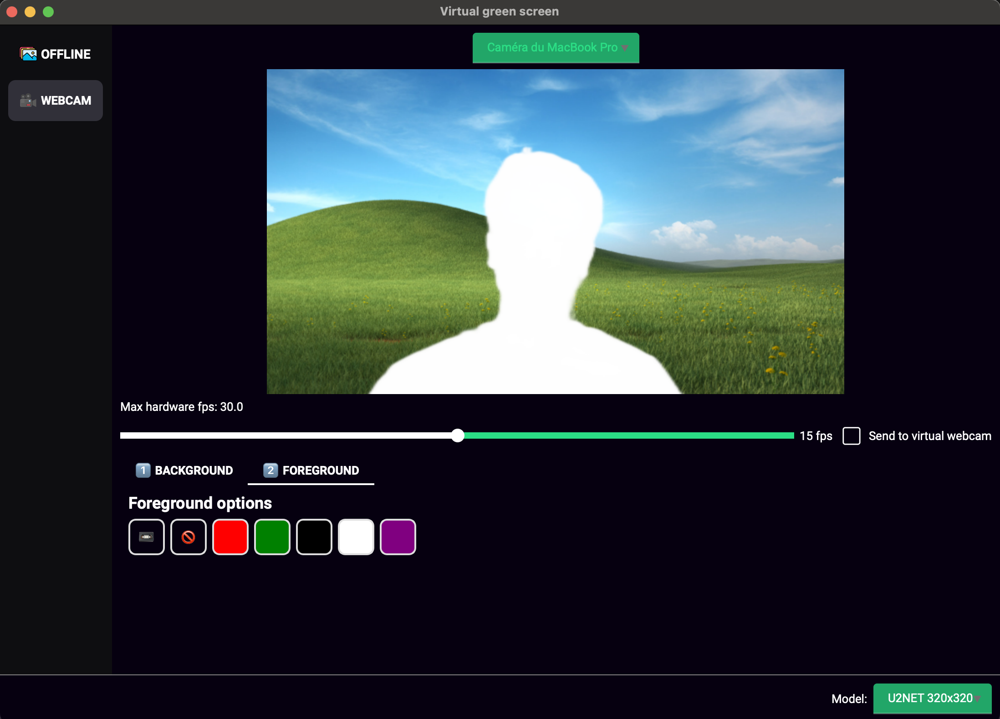

# Virtual Green Screen app

This is a desktop application to remove / modify the background on images or in realtime on the webcam.



### Usage
Start the application by running

```bash
python3 -m venv path/to/new/env/
source path/to/new/env/bin/activate
python3 -m pip install -r requirements.txt
python3 -m app.application
```

### Image Segmentation
The image segmentation is done using the U^2-Net model from Xuebin Qin et al.   

Official repository: [(https://github.com/xuebinqin/U-2-Net](https://github.com/xuebinqin/U-2-Net)

#### Showcase:


### Virtual webcam
Processed realtime webcam stream can be used in other applications (Discord, Zoom, ...), using the `pyvirtualcam` package that'll use the OBS Virtual Webcam stream. 

This package doesn't work on latest MacOS releases, because OBS Virtual Webcam changed behavior.

You need to setup the virtual webcam beforehand to be able to enable it, please read the instructions from the package's README: [https://github.com/letmaik/pyvirtualcam](https://github.com/letmaik/pyvirtualcam)

#### Preview:


There a slider allowing to limit the wanted FPS, to avoid computing more images than desired. 

### Performance
This model inference is quite long, it'll automatically run on CUDA if available on your computer, but I will try to add a faster model.
